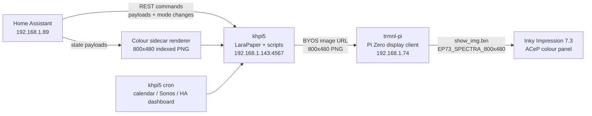

# TRMNL Display

This repository is the source of truth for a Home Assistant-orchestrated TRMNL/LaraPaper e-paper display stack.

The live system uses LaraPaper as a local BYOS TRMNL server, a Pi Zero as a thin display client for a Pimoroni Inky Impression 7.3 / Spectra-class colour panel, and Home Assistant as the mode-selection and automation layer. For colour-critical dashboards, the path forward is a repo-owned indexed colour renderer rather than LaraPaper's default dashboard render path.

## Architecture



## Live Hosts

| Role | Host | Purpose |
|---|---|---|
| LaraPaper server | `khpi5` / `192.168.1.143` | Docker Compose LaraPaper, companion scripts, mode bridge |
| Display client | `trmnl-pi` / `192.168.1.74` | Polls LaraPaper and writes images to the e-paper panel |
| Orchestrator | `home-assistant` / `192.168.1.89` | Helpers, automations, REST commands, display mode selection |
| External UI | `https://trmnl.magnusfamily.co.uk` | Pangolin-proxied LaraPaper UI |

## Repository Layout

| Path | Contents |
|---|---|
| `plugins/` | Shareable TRMNL/LaraPaper plugin recipes and settings |
| `scripts/` | Companion scripts deployed to `khpi5` and `trmnl-pi` |
| `config/packages/` | Home Assistant packages deployed under `/config/packages` |
| `config/trmnl/` | Pi client config examples and `show_img` panel config |
| `deploy/larapaper/` | LaraPaper Docker Compose and nginx proxy support files |
| `deploy/systemd/` | Systemd units for the mode bridge and Pi display client |
| `deploy/khpi5/` | TRMNL-specific cron entries for `khpi5` |
| `docs/` | Operating model, live deployment workflow, project history, and plans |

## Current Modes

The mode bridge accepts these modes:

- `ha_dashboard`
- `calendar`
- `sonos`
- `jen_commute`
- `jen_morning`
- `dave_commute`
- `alert`
- `idle`
- `status`

Home Assistant owns the priority decision. LaraPaper owns the current BYOS management path. Colour-critical dashboard rendering should move through the indexed colour sidecar path. The Pi only fetches and displays the current generated image.

## Source Of Truth Rule

GitHub `main` is authoritative for checked-in configuration, scripts, plugins, and docs. Live changes made directly on `khpi5`, `trmnl-pi`, or Home Assistant must be copied back here and committed before they are considered permanent.

See [Source Of Truth](docs/SOURCE_OF_TRUTH.md) for the workflow.

See [Robust BYOS Flow](docs/ROBUST_BYOS_FLOW.md) for the target operating model and boundaries between Home Assistant, LaraPaper, companion scripts, and the Pi display client.

See [Colour Sidecar Path](docs/COLOUR_SIDECAR_PATH.md) for the accepted direction for rich colour dashboard rendering.

See [Plugin And Recipe Contract](docs/PLUGIN_RECIPE_CONTRACT.md) for the mandatory rule that sidecar-rendered screens must still expose normal plugin fields, payloads, and shareable recipe structure.

See [Hardware Inventory](docs/HARDWARE.md) for the live hardware scan and colour panel identification.

## Deployment

Use the repo files as the desired state:

- `deploy/larapaper/docker-compose.yml` -> `/home/dave/larapaper/docker-compose.yml` on `khpi5`
- `deploy/larapaper/nginx/*` -> `/home/dave/larapaper/nginx/` on `khpi5`
- `scripts/trmnl_mode_bridge.py` -> `/home/dave/bin/trmnl-mode-bridge.py` on `khpi5`
- `scripts/trmnl_set_display_mode.sh` -> `/home/dave/bin/trmnl-set-display-mode` on `khpi5`
- `scripts/trmnl-display-shell.sh` -> `/home/dave/bin/trmnl-display-shell.sh` on `trmnl-pi`
- `deploy/systemd/*.service` -> `/etc/systemd/system/` on the relevant hosts
- `deploy/trmnl-pi/environment` -> `/etc/environment` on `trmnl-pi`
- `config/packages/*.yaml` -> `/config/packages/` on Home Assistant

Do not commit live secrets. Use:

- `deploy/larapaper/.env.example` for LaraPaper environment shape
- `config/trmnl/config.example.json` for Pi client config shape
- Home Assistant `secrets.yaml` for bearer tokens and local credentials

## Validation

For script syntax:

```bash
python -m py_compile scripts/trmnl_calendar_multi.py scripts/trmnl_ha_dashboard.py scripts/trmnl_mode_bridge.py scripts/trmnl_sonos_local.py
```

For the live display path:

```bash
ssh khpi5 "/home/dave/bin/trmnl-set-display-mode status"
ssh trmnl-pi "journalctl -u trmnl-display.service --no-pager -n 40"
```

A TRMNL-facing change is done only when the repo is updated, the live host is updated, LaraPaper generates the expected image, the Pi pulls it, and the physical display is checked.

## Colour Policy

The target panel is a Pimoroni Inky Impression 7.3 / Spectra-class ACeP colour display. Colour regressions are bugs unless explicitly requested. The accepted colour path is an `800x480` indexed/paletted PNG generated intentionally for the panel, with the Pi preparing it as `4-bpp` output through `show_img.bin`.

The first proven sidecar renderer is `scripts/render_colour_dashboard.py`. It generated a seven-colour indexed PNG that refreshed successfully on hardware with:

```text
image specs: 800 x 480, 8-bpp
Preparing image for EPD as 4-bpp
Refresh complete
```

The known LaraPaper model remains `inky_impression_7_3` at `800x480`, palette ID `10`, model bit depth `3`, and the Pi `show_img` panel config is `EP73_SPECTRA_800x480`.

See [Live Deployment Workflow](docs/LIVE_DEPLOYMENT_WORKFLOW.md) for the colour and physical verification rules.

## Status

The live deployment was synced into this repo on `2026-04-30`. The latest verified live state had:

- LaraPaper container healthy on `khpi5`
- `trmnl-display.service` normally active on `trmnl-pi`
- active LaraPaper playlist: `TRMNL Mode: ha_dashboard`
- Pi display refresh succeeding with `800 x 480` images prepared as `4-bpp`
- direct seven-colour sidecar proof refreshed successfully on hardware on `2026-05-01`
