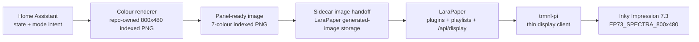

# Colour Sidecar Path

Date: 2026-05-01

This is the path forward for the Home Assistant dashboard on the live TRMNL display.

## Decision

Use a repo-owned colour renderer for colour-critical dashboards.

LaraPaper remains valuable for BYOS device management, playlists, plugin storage, and the normal TRMNL API surface, but it is no longer assumed to be the best renderer for the colour dashboard. The live panel can display a richer indexed colour image when the image is generated directly for the Inky/Spectra path.

## Proven Result

The canonical accepted proof image is:

```text
scripts/tmp/sidecar_colour_dashboard_proof_2026-05-01.png
```

The RGB source reference is:

```text
scripts/tmp/sidecar_colour_dashboard_source_proof_2026-05-01.png
```

These files are tracked references and must not be overwritten by normal renderer runs. The proof was recreated from:

```text
git show 4d6d640:scripts/render_colour_dashboard.py
```

This proof defines the visual direction for the colour dashboard: strong seven-colour panel output, icon-led cards, black outlines, readable text, and clear Home Assistant status blocks. Do not regress this screen to the muted LaraPaper-style green/olive render; that path is retained only as compatibility context, not as the target colour dashboard design.

The current renderer is:

```text
scripts/render_colour_dashboard.py
```

It consumes the HA dashboard plugin payload contract (`merge_variables`) and writes next-iteration files by default:

```text
scripts/tmp/sidecar_colour_dashboard_source_next.png
scripts/tmp/sidecar_colour_dashboard_next.png
```

The output PNG is an indexed seven-colour image using:

- black
- white
- red
- yellow
- blue
- green
- orange

Direct hardware test on `trmnl-pi`:

```sh
scp scripts/tmp/sidecar_colour_dashboard_next.png trmnl-pi:/tmp/sidecar_colour_dashboard_next.png
ssh trmnl-pi "sudo systemctl stop trmnl-display.service && /usr/local/bin/show_img.bin file=/tmp/sidecar_colour_dashboard_next.png invert=false mode=full"
```

Confirmed output:

```text
image specs: 800 x 480, 8-bpp
Preparing image for EPD as 4-bpp
Refresh complete
```

This proves the physical Pi and panel can accept richer colour than the current LaraPaper-generated dashboard path.

## Target Architecture



## Rendering Rules

1. Render at exactly `800x480`.
2. Keep the final panel image indexed/paletted, not full RGB.
3. Use the panel palette deliberately; do not rely on incidental CSS colour quantization.
4. Preserve strong black text and icon outlines.
5. Test generated PNGs locally before physical refresh.
6. Use direct `show_img.bin` tests for colour experiments before wiring them into the polling loop.
7. Once a screen is accepted, route it through a BYOS-compatible image URL so the Pi remains a thin client.

## Development Flow

1. Update `scripts/render_colour_dashboard.py` or successor renderer code.
2. Generate the source and indexed output PNGs from `plugins/trmnl-ha-dashboard/payload.example.json` or a live payload written by `scripts/trmnl_ha_dashboard.py`.
3. Inspect the generated image visually.
4. Confirm palette use with Pillow or an equivalent image tool.
5. Stop `trmnl-display.service` only when doing a direct hardware proof.
6. Push the image to `/tmp` on `trmnl-pi`.
7. Run `show_img.bin`.
8. Record the result in docs and commit the source changes.

## Next Implementation Step

Turn the proof into a live sidecar flow:

- fetch real Home Assistant state
- render the accepted dashboard layout
- emit an indexed seven-colour PNG
- install it into LaraPaper's generated-image storage during `ha_dashboard` mode activation
- keep the Pi polling LaraPaper's normal BYOS `/api/display` endpoint

The first live version is intentionally simple. `scripts/trmnl_set_display_mode.sh` activates the normal LaraPaper HA dashboard playlist, then hands off the repo-rendered sidecar PNG by copying it into LaraPaper's generated-image storage and updating LaraPaper's current image pointer for that plugin/device. LaraPaper remains the BYOS server and rollback is selecting another mode or disabling the handoff environment.

Local render command:

```sh
python scripts/render_colour_dashboard.py --payload plugins/trmnl-ha-dashboard/payload.example.json
```

## Plugin Compatibility Requirement

The sidecar must not become a private hardcoded dashboard.

Before it becomes the normal live path, it must honor the HA dashboard plugin contract:

- configuration fields in `plugins/trmnl-ha-dashboard/settings.yml`
- sidecar field schema in `plugins/trmnl-ha-dashboard/fields.schema.json`
- payload shape in `plugins/trmnl-ha-dashboard/payload.example.json`
- install and configuration docs in `plugins/trmnl-ha-dashboard/README.md`

If the sidecar cannot support one of those plugin/recipe expectations, document the blocker and the fallback in the plugin README before shipping it.

Current status: the sidecar renderer consumes the same `merge_variables` payload shape as the plugin and preserves the accepted proof style. `scripts/trmnl_ha_dashboard.py` writes the live sidecar payload via `TRMNL_SIDECAR_PAYLOAD_PATH`, the `khpi5` cron renders the indexed PNG, and `scripts/trmnl_set_display_mode.sh` hands the image to LaraPaper when `ha_dashboard` is active.

Sidecar handoff test command on `khpi5`:

```sh
/home/dave/bin/trmnl-set-display-mode ha_dashboard
curl -fsS http://127.0.0.1:4567/storage/images/generated/sidecar_colour_dashboard_next.png -o /tmp/ha-dashboard.png
```
