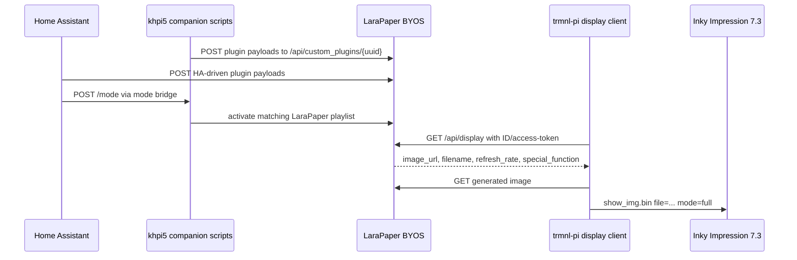

# Robust LaraPaper/TRMNL BYOS Flow

This plan defines the target operating flow for a robust TRMNL/LaraPaper BYOS deployment.

## Principles

1. **Use BYOS boundaries deliberately.** LaraPaper currently owns plugin rendering, generated images, playlists, and the `/api/display` response. If colour quality requires it, a repo-owned colour renderer may generate the image while LaraPaper remains the management server, or Terminus may be piloted as a replacement BYOS server.
2. **Keep the Pi client thin.** The Pi should not know about Home Assistant, calendar APIs, Sonos APIs, or display modes. It should poll LaraPaper and display the returned image.
3. **Keep Home Assistant as the orchestrator.** HA should decide which mode is wanted, push payloads, and call the mode bridge. HA should not contain Liquid layout logic.
4. **Keep recipes shareable.** Plugins in `plugins/` should remain import/export-safe and receive generic payloads.
5. **Preserve ACeP colour.** The target is the live Inky Impression 7.3 colour path: LaraPaper-generated `800x480` colormap PNGs and Pi `EP73_SPECTRA_800x480` output.
6. **Make GitHub authoritative.** Live state should be deployed from this repo or immediately reconciled back into it.

## Target Data Flow

## System Boundaries

### LaraPaper

Responsible for:

- plugin storage and rendering
- generated image storage
- device registration and `/api/display`
- playlists and active mode output
- web UI preview

Not responsible for:

- choosing the semantic display mode
- polling Sonos, calendar, or HA directly unless a specific plugin is intentionally configured that way
- being the only acceptable colour renderer if a BYOS-compatible sidecar produces more faithful Inky/Spectra output

### Colour Renderer Sidecar

Allowed when LaraPaper's renderer cannot preserve the colour range of the live panel.

Responsible for:

- rendering the target dashboard at `800x480`
- remapping the rendered image to an explicit Inky/Spectra palette
- comparing generated output against LaraPaper output before physical refresh
- exposing or handing off a BYOS-compatible image URL

Not responsible for:

- device identity and access-token management
- playlists and plugin ownership unless it intentionally replaces LaraPaper
- mode decisions

### Home Assistant

Responsible for:

- mode priority
- helper state
- event-based automation
- calling `rest_command.trmnl_set_display_mode`
- pushing HA-native payloads

Not responsible for:

- rendering layouts
- direct panel control
- long-lived image generation

### khpi5 Companion Scripts

Responsible for:

- calendar ICS ingestion
- local Sonos discovery and payload shaping
- HA dashboard payload fallback/cache behaviour
- authenticated mode bridge
- writing LaraPaper playlist state through the LaraPaper container

Not responsible for:

- directly driving the panel
- replacing LaraPaper rendering

### trmnl-pi

Responsible for:

- polling LaraPaper using the TRMNL BYOS API shape
- downloading the returned image
- displaying it with `show_img.bin`
- sleeping for the returned refresh interval

Not responsible for:

- mode decisions
- webhook payload generation
- plugin rendering

## Robustness Plan

### 1. Drift Control

Keep all managed files in this repo and use `docs/SOURCE_OF_TRUTH.md` as the mapping. Add a periodic drift check for:

- `khpi5` scripts
- `trmnl-pi` display shell and `show_img.json`
- Home Assistant TRMNL packages
- LaraPaper compose/nginx files
- systemd units

### 2. Health Checks

Automate or document checks for:

- LaraPaper container health
- active LaraPaper playlist
- mode bridge health
- last successful plugin payload push
- last Pi `/api/display` request
- last Pi `show_img.bin` completion

### 3. Deployment Discipline

Use this sequence for changes:

1. edit repo
2. run syntax checks
3. deploy changed files
4. reload/restart affected service only
5. validate LaraPaper preview/generated PNG
6. validate Pi pull/display log
7. commit and push

### 4. Payload Contracts

Each plugin should have a README that states:

- required payload fields
- optional payload fields
- companion script or HA automation source
- display modes or settings
- ACeP colour assumptions

### 5. Security

Keep secrets in live secret stores:

- LaraPaper app key in `/home/dave/larapaper/.env`
- mode bridge token in `/home/dave/.env.trmnl-mode-bridge`
- Sonos webhook env in `/home/dave/.env.sonos-trmnl`
- Pi device API key in `/home/dave/.config/trmnl/config.json`
- HA bearer values in Home Assistant `secrets.yaml`

### 6. Rollback

Rollback should be file-based and service-scoped:

- revert commit locally
- redeploy only changed files
- restart only affected service
- verify LaraPaper and Pi logs

For LaraPaper image updates, keep the previous Docker image available when possible and keep compose backups on `khpi5`.

### 7. Maintenance

Safe routine maintenance:

- `apt-get update && apt-get upgrade` on `khpi5` and `trmnl-pi`
- controlled `full-upgrade` only when kernel packages are held back
- reboot `trmnl-pi` after kernel upgrades
- `docker compose pull && docker compose up -d` for LaraPaper
- Home Assistant `ha core check` before restart

Do not update unrelated homelab containers as part of this repo's flow unless explicitly requested.

## Target End State

The robust end state is:

- repo-managed files match live files
- Home Assistant packages are validated before restart
- LaraPaper is healthy after image updates
- Pi logs show successful `800 x 480, 4-bpp` panel refreshes
- generated images remain colour-capable
- colour-critical screens use an explicit palette/remap pipeline when LaraPaper's default renderer is insufficient
- no live-only changes exist after a task is complete
